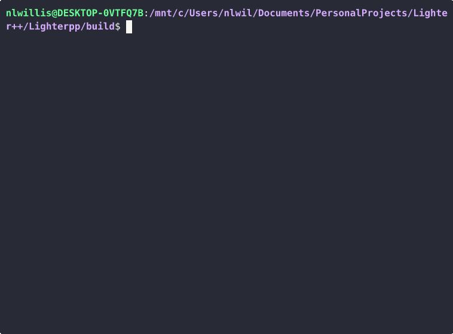

# Lighter++: A C++/CUDA LLM Inference Engine

**Author:** Nate Willis  
**Status:** In Development (Phase III: CUDA Acceleration & Optimization)



*(Running inference on the Llama 3.2 1B parameter model)*

## Abstract
Lighter++ is a high-performance, custom-built Inference Engine for Large Language Models (LLMs), specifically targeting the Llama 2 architecture. Implemented entirely in C++ and CUDA without using existing frameworks like PyTorch or TensorFlow. This is to learn and demonstrate a "from-scratch" understanding of tensor operations, memory management, and hardware optimization.

The engine currently supports loading **GGUF** model checkpoints (e.g., `tinyllama-1.1b-chat.gguf`), enabling support for real-world models. It also has legacy support for loading `llama2.c` compatible model checkpoints (e.g., `stories15M.bin`, `stories110M.bin`).

## Current Status: GPU-Resident Inference
The entire transformer forward pass now runs on the GPU with **zero CPU involvement** per token. The only memory transfers are the token embedding in (once per token) and the sampled token ID out (4 bytes). All intermediate computations—RMSNorm, RoPE, Q/K/V projections, attention scoring, softmax, aggregation, FFN, and sampling—remain on device memory throughout inference.


### Performance Benchmarks
**Hardware:** AMD Ryzen 7 5700x3d, NVIDIA RTX 3070 (8GB VRAM), WSL2 (Ubuntu)

#### TinyLlama-1.1B-Chat (FP16)
| Version | Performance | vs llama.cpp | Notes |
| :--- | :---: | :---: | :--- |
| v0.1 | 45 tok/s | 31% | Basic GPU-Resident (FP32) |
| v0.2 | 72 tok/s | 50% | Native Half-Precision |
| **v0.3** | **114 tok/s** | **80%** | **Fused GPU Sampling (1.6x)** |
| *llama.cpp* | *142 tok/s* | *100%* | *Reference* |


#### Llama 3.2 1B (FP16, 128K vocab)
| Version | Performance | vs llama.cpp | Notes |
| :--- | :---: | :---: | :--- |
| v0.2 | 40 tok/s | 28% | CPU sampling bottleneck |
| **v0.3** | **105 tok/s** | **75%** | **Fused GPU Sampling (2.6x)** |
| *llama.cpp* | *140 tok/s* | *100%* | *Reference* |

(*Note: next steps to catch up to llama.cpp include implementing more fused kernels*)

## Key Architectural Decisions

### Memory Management
*   **Standard Library Only:** Built with zero external dependencies to ensure a "from-scratch" understanding of the math and memory management.
*   **Memory Mapped Loading (`mmap`):** Model weights are mapped directly into the process's virtual address space. This "zero-copy" implementation uses lazy loading to only load weights as needed.
*   **GPU-Resident Data Flow:** After loading, weights are copied to GPU memory once at startup. During inference, data stays on the GPU—eliminating per-token CPU↔GPU transfers that would otherwise bottleneck performance.

### Tensor Layout & KV Cache
*   **Flattened Tensor Layout:** The KV Cache uses a strided memory layout to ensure attention keys and values are contiguous in memory, maximizing cache hits during the attention step.

### CUDA Kernel Design
*   **Multi-Head Kernels:** Scale, Softmax, and Aggregation kernels process all attention heads in a single launch using 2D grids (`blockIdx.y` = head index). This reduces kernel launch overhead from O(n_heads × n_layers) to O(n_layers) per token.
*   **Warp-Level Reductions:** Several kernels use `__shfl_down_sync` for fast intra-warp communication, avoiding shared memory bank conflicts.
*   **Float4 Vectorization:** Memory-bound kernels (Scale, Residual Add) use `float4` loads/stores for 4x memory throughput improvement. 
*   **Float2 Vectorization:** RoPE uses `float2` for each pair of dimensions.

### Fused GPU Sampling
*   **Single Kernel Sampling:** Instead of copying 512KB of logits back to CPU (128K vocab × 4 bytes), sampling runs entirely on GPU in a single fused kernel that performs repetition penalty, temperature scaling, softmax, and categorical sampling.
*   **4-Byte Result:** Only the final token ID (4 bytes) is copied back to host, eliminating a major PCIe bottleneck.
*   **Impact:** 2.3x speedup on Llama 3 (40 → 93 tok/s) by eliminating CPU softmax over 128K vocabulary.


## Difficult Issues & Bug Log

### Phase II Bugs (CPU Era)

#### 1. The "Six Layer 1s" Bug
Early in Phase II, the model was generating tokens but collapsing into repetition after only the first few tokens. This was caused by the layer 1 weights being used for every layer.
*   **Cause:** A missing layer offset in the attention function.
*   **Fix:** Implemented specific `layer_offset` logic for the attention function.

#### 2. The "Destructive In-place MatMul" Bug
A subtle bug caused the model to fall into nonsensical loops (e.g., "flowers to shower the flowers").
*   **Cause:** The Attention output projection was using the same buffer (xb) for source and output, causing destructive in-place operations.
*   **Fix:** Implemented separate buffers (xb, xb2) in `RunState`.

### Phase III Bugs (CUDA Era)

#### 3. The "CPU Path Broke After Refactor" Bug
After removing unused parameters (`in`, `out`, `x`) from GPU-optimized functions, the CPU build failed to compile.
*   **Cause:** CPU code paths still referenced the removed parameters.
*   **Fix:** Updated CPU paths to use `s->xb` directly instead of function parameters.

#### 4. GGUF Integration Issues
*   **Shared Memory Overflow:**
    *   **Cause:** Hardcoded 4096 float buffer in `gemv_kernel` overflowed with larger models (5632 dim), causing silent corruption.
    *   **Fix:** Increased buffer to 40KB (10240 floats) and added runtime safety check.

#### 5. Llama 3 Performance "Tank"
*   **Cause:** Static shared memory allocation (40KB) limited occupancy to 2 blocks/SM. The massive 128k vocabulary grid launch serialized and crawled.
*   **Fix:** Implemented **Dynamic Shared Memory** to request exact size (~4KB), increasing SM occupancy and parallelism 10x.

#### 6. VRAM Exhaustion
*   **Cause:** Llama 3 defaulted to 131k context window, allocating 4GB for KV cache relative to the 8GB GPU.
*   **Fix:** Capped default sequence length to 16k on consumer hardware to prevent OS-level swapping.

**Lessons Learned:** Comprehensive unit tests are necessary to catch silent failures. Integration tests comparing GPU vs CPU output helped isolate kernel-level bugs. Warning when model defaults exceed hardware limits is crucial.


## Technical Stack
*   **Language:** C++17, CUDA
*   **Build System:** CMake
*   **External Dependencies:** None (Standard Library + CUDA Runtime only)
*   **Target Architecture:** CPU fallback, NVIDIA GPU (Compute Capability 7.5+)

## Project Structure

```text
├── src/
│   ├── loader.h/cpp      # Binary file I/O and memory mapping
│   ├── model.h/cpp       # Model topology, weight pointers, forward pass
│   ├── tensor.h/cpp      # Tensor structures and data definitions
│   ├── ops.h/cpp         # CPU math kernels (MatMul, RMSNorm, RoPE)
│   ├── tokenizer.h/cpp   # Tokenizer
│   ├── main.cpp          # Application entry point
│   ├── runtests.cpp      # Unit testing suite
│   ├── matmul.cu         # CUDA GEMV kernel
│   ├── multihead_gemv.cu # CUDA Multi-Head Attention kernel
│   ├── RMSNorm.cu        # CUDA RMSNorm kernel
│   ├── rope.cu           # CUDA RoPE kernel
│   ├── swiglu.cu         # CUDA SwiGLU kernel
│   ├── softmax.cu        # CUDA Softmax kernel (multi-head)
│   ├── scale.cu          # CUDA Scale kernel (multi-head)
│   ├── aggregation.cu    # CUDA Aggregation kernel (multi-head)
│   ├── residual.cu       # CUDA Residual Add kernel
│   ├── scatter_kv.cu     # CUDA KV Cache scatter kernel
│   ├── sample.cu         # CUDA Fused Sampling kernel
│   └── kernels.cuh       # CUDA kernel declarations
├── CMakeLists.txt        # Build configuration
└── README.md             # Documentation
```

## Getting Started
### 1. Build
Lighter++ uses CMake. Ensure you have a C++17 compiler and (optionally) CUDA Toolkit installed.

```bash
mkdir build
cd build

# CPU-only build
cmake ..
make

# GPU-accelerated build (requires CUDA)
cmake .. -DUSE_CUDA=ON
make
```

### 2. Download Model & Tokenizer
This engine is compatible with the "stories" models from the TinyLlamas project.

```bash
# Download 110M parameter model (recommended for GPU testing)
wget https://huggingface.co/karpathy/tinyllamas/resolve/main/stories110M.bin

# Download 15M parameter model (faster for quick tests)
wget https://huggingface.co/karpathy/tinyllamas/resolve/main/stories15M.bin

# Download Tokenizer
wget https://github.com/karpathy/llama2.c/raw/master/tokenizer.bin
```

### 3. Run Verification
Lighter++ includes a test suite to verify the mathematical correctness of its operations.

```bash
./runtests
```

### 4. Run the Engine

```bash
./Lighter++ ../stories110M.bin ../tokenizer.bin [temperature]
```
*   `temperature`: (Optional) Randomness of generation. `0.0` for deterministic, `0.9` default.


## Implementation Roadmap

### Phase I: The CPU Foundation (Completed)

- [x] Project Setup: CMake build system and repo structure.
- [x] Tensor Core: Data structures for tensor operations.
- [x] Model Loader: mmap based binary weight loading.
- [x] Basic Math: Naive Matrix-Vector multiplication (GEMV).
- [x] Testing: Unit test suite for linear algebra operations.

### Phase II: The Transformer Architecture (Completed)

- [x] State Management: KV Cache allocation and management.
- [x] Normalization: RMSNorm implementation.
- [x] Positional Embeddings: Rotary Positional Embeddings (RoPE).
- [x] Activation Functions: Softmax and SwiGLU.
- [x] Attention: Multi-Head Attention with Grouped Query Attention (GQA) support.
- [x] FeedForward Network: Gate, Up, and Down projections with SwiGLU.
- [x] Transformer Block: Full layer with residual connections.
- [x] Single-Token Inference: Forward pass through all layers.
- [x] Multi-Token Generation: Autoregressive sampling loop.
- [x] Tokenizer: Decode token IDs to text.

### Phase III: CUDA Acceleration (In Progress)

- [x] GPU Memory Management: Device allocation for weights, activations, and KV cache.
- [x] CUDA Kernels: GEMV, RMSNorm, RoPE, SwiGLU, Softmax, Scale, Aggregation, Residual Add.
- [x] Multi-Head Kernels: Single-launch kernels for Scale, Softmax, and Aggregation.
- [x] Memory Transfer Optimization: Single memcpy per token (GPU-resident inference).
- [x] **Multi-Head GEMV Kernel** (Major Speedup).
- [x] **GGUF Format Support**.
- [ ] Quantization: INT4 weight compression.

### Phase IV: Production Features (Future)
- [x] LLaMA 3 Architecture Support.
- [ ] Prompt/Chat Interface.
- [ ] Final Documentation and Benchmarks.


<details>
<summary><strong>Legacy Benchmarks (TinyStories 110M)</strong></summary>

#### stories110M.bin (110M Parameters)
| Engine | Performance (tok/s) | Notes |
| :--- | :---: | :--- |
| **Lighter++ (CPU)** | 11 | Single-threaded CPU baseline |
| **llama2.c** | 12 | Reference implementation (CPU) |
| **Lighter++ (GPU v0.2)** | 128 | Full CUDA acceleration |
| **Lighter++ (GPU v0.3)** | 250 | Fused GPU Sampling |

*GPU v0.3 achieves ~23x speedup over single-threaded CPU baseline*
</details>

## Acknowledgments

*   **Andrej Karpathy:** For [llama2.c](https://github.com/karpathy/llama2.c), which served as the direct reference implementation and inspiration for this project.
*   **Meta AI:** For the design of the original [Llama 2 architecture](https://ai.meta.com/llama/), which defines the mathematical structure used in this engine.
*   **TinyStories:** [TinyStories: How Small Can Language Models Be?](https://arxiv.org/abs/2305.07759) - The paper and source for the models used in testing.
